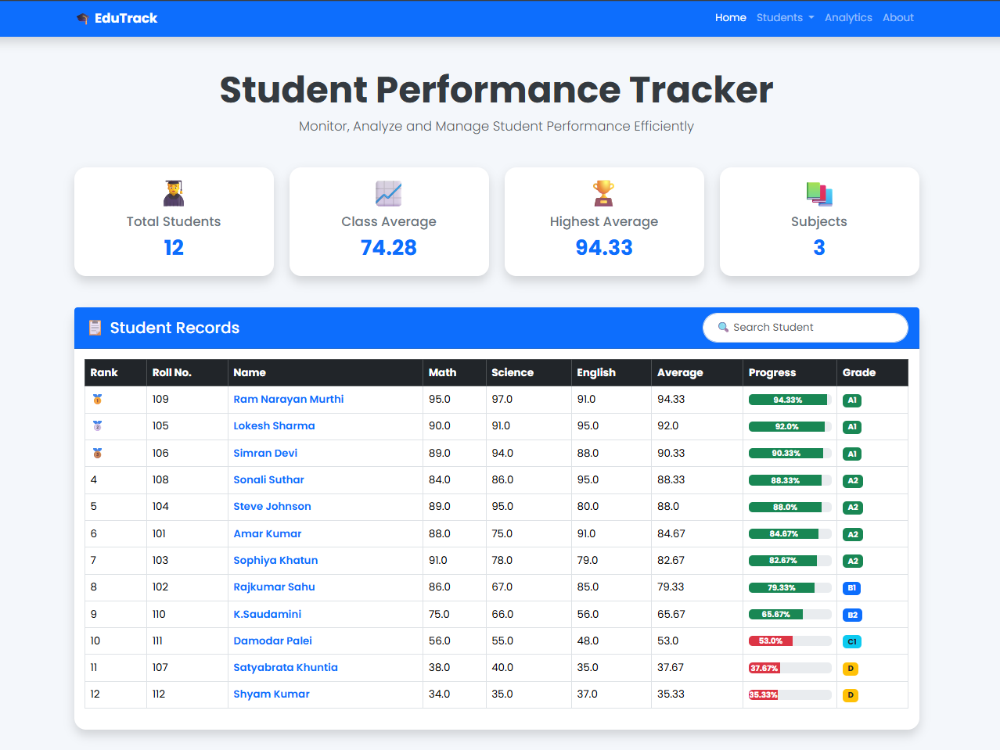

# 🎓 EduTrack

<div align="center">

### Student Management System

*A student management system built using Python, Flask, PostgreSQL and Bootstrap.*


</div>

---

# 📖 About

EduTrack is a project that I started while learning Python. It was first built as a simple command-line application, and later I converted it into a web application using Flask and PostgreSQL.

The main goal of this project is to understand how a real Student Management System works by building it step by step.

While developing EduTrack, I am learning backend development, database management, frontend design, deployment, and GitHub project management.

This project is still under development, and I continue adding new features as I learn.

---

# ✨ Features

## 👨‍🎓 Student Management

- ✅ Add New Student
- ✅ View Student Details
- ✅ Edit Student Information
- ✅ Delete Student
- ✅ Unique Roll Number Validation
- 🚧 Student Search (Working on it)

---

## 📚 Academic Records

- Store marks for multiple subjects
- Automatic average calculation
- Automatic grade generation
- Marks validation
- PostgreSQL cloud database

---

## 🌐 Web Application

- Responsive Flask website
- Bootstrap 5 interface
- Student profile page
- Flash messages
- Real-time database updates
- Mobile-friendly design (Improving)

---

## 📊 Dashboard

Current Dashboard includes:

- Student Ranking
- Average Marks
- Highest Score
- Progress Bar
- Grade Badges

More dashboard improvements are coming soon.

---

## ☁ Deployment

- Hosted on Render
- PostgreSQL Cloud Database
- Gunicorn Production Server
- Environment Variables

---

# 🛠 Tech Stack

| Category | Technology |
|-----------|------------|
| Language | Python |
| Framework | Flask |
| Frontend | HTML5, CSS3, Bootstrap 5 |
| Database | PostgreSQL |
| Deployment | Render |
| Server | Gunicorn |
| Version Control | Git & GitHub |

---

# 📂 Project Structure

```text
EduTrack/

├── app.py
├── requirements.txt
├── Procfile
├── README.md

├── templates/
│
├── layouts/
│   └── base.html
│
├── partials/
│   ├── navbar.html
│   └── footer.html
│
├── students/
│   ├── list.html
│   ├── add.html
│   ├── details.html
│   └── edit.html
│
├── static/
│
├── css/
│   └── style.css
│
├── js/
│   └── script.js
│
└── images/
```

---

# 📸 Screenshots

Project screenshots will be updated as I continue improving the UI.
## Home



## Dashboard


---

# 📈 Current Progress

- ✅ CLI Application
- ✅ Flask Web Application
- ✅ PostgreSQL Integration
- ✅ Render Deployment
- ✅ Complete CRUD Operations
- 🚧 Dashboard Redesign
- 🚧 Student Search
- 🚧 Analytics

---

# 🎯 Next Steps

The features I plan to add next are:

- Dashboard with Top 10 Students
- View All Students Page
- Search Students
- Analytics Dashboard
- Charts and Graphs
- Student Login
- Admin Login
- Attendance Management
- PDF Report Generation
- Excel Export

I will keep updating this project as I continue learning.

---

# 🤝 Contributions

Suggestions and ideas are always welcome.

If you find something that can be improved, feel free to open an issue or submit a pull request.

---

# 👨‍💻 About Me

Hi, I'm **Sagar Nayak**.

I'm passionate about learning Python, Data Analytics, and Web Development by building practical projects instead of only following tutorials.

EduTrack is one of my learning projects, and I continue improving it as I learn new technologies.

GitHub:
**https://github.com/alpha00045**

---

# ⭐ Support

If you like this project, please consider giving it a ⭐.

It motivates me to keep learning and building better projects.

---

<div align="center">

### Thanks for visiting my project ❤️

I'm always learning, improving, and building.

</div>
