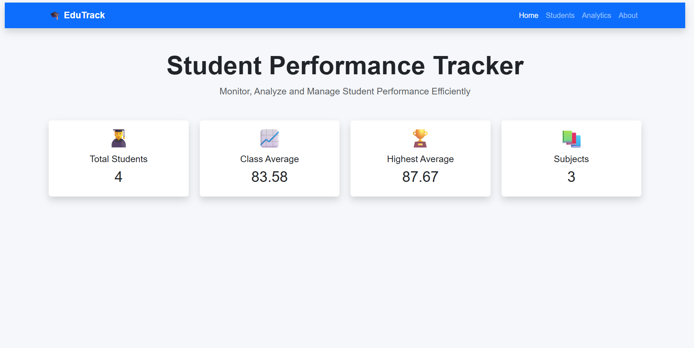

# 🎓 EduTrack

<div align="center">

### Student Performance Analytics Platform

*A modern Flask-powered student management and analytics system with PostgreSQL cloud database.*


</div>

---

# 📖 About EduTrack

EduTrack is a modern **Student Performance Analytics Platform** built using **Python**, **Flask**, and **PostgreSQL**.

The project started as a Command Line Interface (CLI) application and is now evolving into a professional web-based analytics dashboard.

It enables teachers and administrators to manage student records, assign grades, analyze academic performance, and visualize educational data through an intuitive web interface.

---

# ✨ Features

## 👨‍🎓 Student Management

- Add New Students
- Unique Roll Number Validation
- Edit Student Records *(Coming Soon)*
- Delete Students *(Coming Soon)*
- Search Students *(Coming Soon)*

---

## 📚 Academic Records

- Assign Subject Marks
- Grade Validation (0–100)
- Automatic Average Calculation
- Cloud Database Storage

---

## 📊 Analytics

- Subject Topper
- Class Average
- Student Average
- Performance Dashboard *(In Development)*
- Charts & Graphs *(Coming Soon)*

---

## 🌐 Web Dashboard

- Responsive Flask Website
- Bootstrap 5 Interface
- PostgreSQL Integration
- Real-Time Database Updates
- Mobile Friendly UI *(In Development)*

---

## ☁ Deployment

- Hosted on Render
- Gunicorn Production Server
- PostgreSQL Cloud Database
- Environment Variable Configuration

---

# 🛠 Tech Stack

| Category | Technology |
|-----------|------------|
| Language | Python |
| Framework | Flask |
| Frontend | HTML5, CSS3, Bootstrap 5 |
| Database | PostgreSQL |
| Deployment | Render |
| Server | Gunicorn |
| Version Control | Git & GitHub |

---

# 📂 Project Structure

```text
EduTrack/
│
├── app.py
├── main.py
├── requirements.txt
├── Procfile
├── README.md
├── User_Guide.txt
├── student_backup.txt
│
├── templates/
│   ├── base.html
│   └── index.html
│
├── static/
│   ├── css/
│   │   └── style.css
│   ├── js/
│   │   └── script.js
│   └── images/
```
---

# 📸 Screenshots

> Screenshots will be added as the UI development progresses.
## 📸 Project Screenshot



```
Homepage
Dashboard 
Analytics
Student Management
```

---

# 📈 Project Status

| Module | Status |
|---------|--------|
| CLI Application | ✅ Completed |
| Flask Integration | ✅ Completed |
| PostgreSQL Integration | ✅ Completed |
| Render Deployment | ✅ Completed |
| Responsive UI | 🚧 In Progress |
| Dashboard | 🚧 In Progress |
| Analytics | 🚧 In Progress |
| Charts | ⏳ Planned |
| Authentication | ⏳ Planned |

---

# 🎯 Future Enhancements

- Student Login
- Admin Authentication
- Attendance Management
- PDF Report Generation
- Excel Export
- Email Notifications
- Performance Prediction
- AI-Based Insights

---

# 🤝 Contributing

Contributions, suggestions, and feature requests are welcome.

If you would like to improve EduTrack, feel free to fork the repository and submit a Pull Request.

---

# 👨‍💻 Developer

**Sagar Nayak**

Aspiring Data Analyst & Python Developer

GitHub: https://github.com/alpha00045

---

# ⭐ Support

If you found this project helpful,

⭐ **Star this repository**

It motivates me to build more open-source projects.
